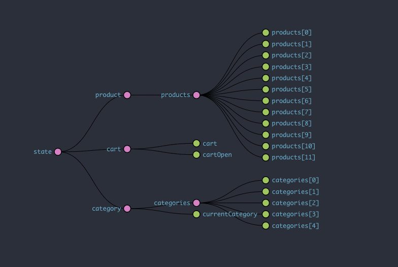

    
# Redux Refactor (e-commerce site)

## License

## Description
    
Take an existing e-commerce site that uses Context API to manage State, and refactor the code to use Redux API

## Table of Contents

* [Installation](#installation)
* [Deployment](#deployment)
* [Usage](#usage)
* [Screenshot](#screenshot)
* [Component State Tree](#component-state-tree)
* [Credits](#credits)
* [License](#license)
* [Tests](#tests)
* [Questions](#questions)
    
## Installation

Clone the repository, navigate to the root directory of the project and run npm install, then npm seed, and finally npm start.

## Deployment

[shop-shop](https://immense-reaches-31180.herokuapp.com/)

## Usage

Users can login, navigate through the products page, add items to a cart, see product descriptions, and finally 'checkout' with 'stripe' payments platform.

## Screenshot

## Component State Tree

Image captured during app use via Redux DevTools

## Credits

*[@coding-boot-camp](https://github.com/coding-boot-camp)

## Contributing

## Tests
no current test method

## Questions

Please send additional questions to [@coderjake91](https://github.com/coderjake91), email: jacob.b.frazer@gmail.com